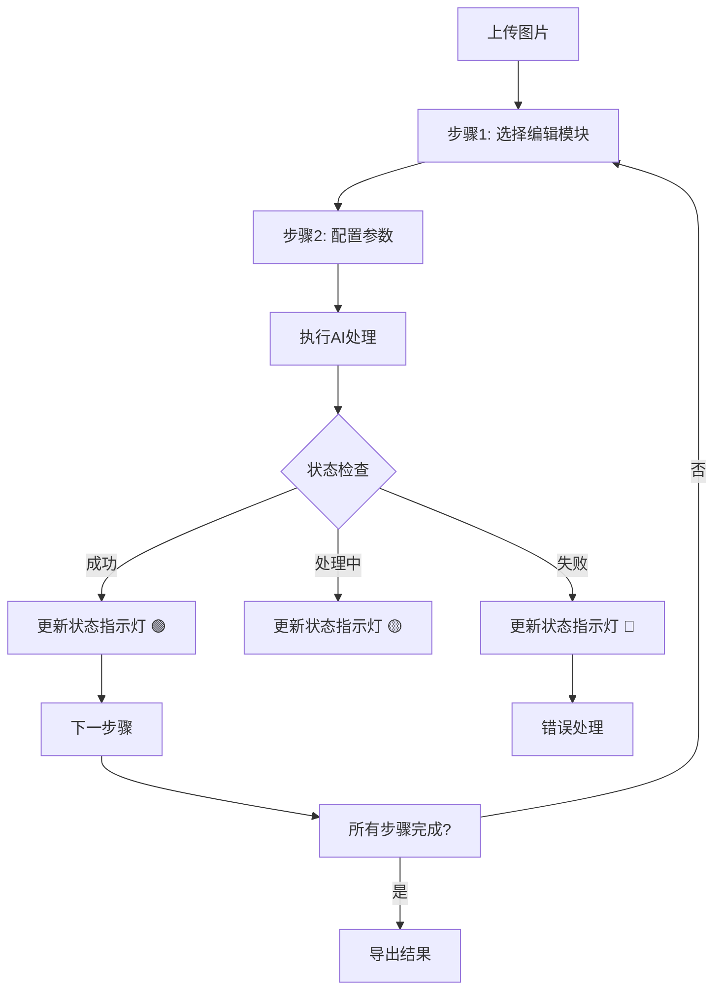
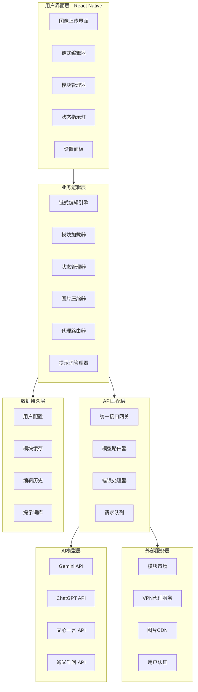

# CT AI - 智能图像链式编辑应用需求文档

## 1. 项目概述
CT AI 是一款跨平台智能图像编辑应用，通过集成多AI模型API与链式编辑系统，让用户无需专业设计技能也能一站式完成复杂的图像编辑任务。

## 2. 核心功能需求

### 2.1 图像编辑功能模块
```typescript
interface EditModule {
  id: string;
  name: string;
  category: 'repair' | 'enhancement' | 'style' | 'creative';
  enabled: boolean;
  parameters: ModuleParameter[];
}
```

**基础编辑模块**：
- ✅ **线稿上色** - 自动识别线稿并智能上色
- ✅ **人物消除** - 智能移除指定人物或物体
- ✅ **自动打光** - 智能调整图片光影效果
- ✅ **背景替换** - 一键更换图片背景
- ✅ **风格转换** - 转换为指定艺术风格
- ✅ **画质增强** - 超分辨率重建和细节恢复
- ✅ **老照片修复** - 破损修复和色彩还原

**高级编辑模块**：
- ✅ **人像美化** - 智能美颜和五官优化
- ✅ **创意生成** - 图像扩展和元素添加
- ✅ **特效合成** - 光效和天气效果添加

### 2.2 链式编辑系统


**核心特性**：
- ✅ **可视化流程编辑器** - 拖拽式步骤编排
- ✅ **实时状态指示灯** - 🟢成功 🟡处理中 🔴失败
- ✅ **步骤管理** - 添加、删除、排序、复制编辑步骤
- ✅ **条件分支** - 基于处理结果的条件流程
- ✅ **实时预览** - 每一步处理结果即时显示

### 2.3 多模型API管理系统
```typescript
interface ModelConfig {
  name: string;
  provider: string;
  capabilities: string[];
  costPerImage: number;
  requiresVPN: boolean;
  region: 'domestic' | 'foreign';
}

// 支持的模型
const AI_MODELS = {
  // 国外模型
  gemini: { requiresVPN: true, capabilities: ['image_analysis', 'generation'] },
  chatgpt: { requiresVPN: true, capabilities: ['image_analysis'] },
  dall_e: { requiresVPN: true, capabilities: ['image_generation'] },
  
  // 国内模型  
  wenxin: { requiresVPN: false, capabilities: ['image_analysis', 'generation'] },
  tongyi: { requiresVPN: false, capabilities: ['image_analysis'] },
  spark: { requiresVPN: false, capabilities: ['image_analysis'] }
};
```

**智能路由功能**：
- ✅ **模型推荐** - 根据任务类型推荐最佳模型
- ✅ **负载均衡** - 自动选择可用且响应快的模型
- ✅ **故障转移** - 主模型失败时自动切换备用模型
- ✅ **成本优化** - 平衡效果与成本的选择策略

### 2.4 VPN代理管理系统
```typescript
interface VPNConfig {
  enabled: boolean;
  proxyType: 'system' | 'manual' | 'pac';
  modelSettings: {
    [modelName: string]: boolean; // 是否对该模型使用代理
  };
  autoSwitch: boolean; // 根据模型区域自动切换
}

class ProxyRouter {
  async shouldUseProxy(model: string): Promise<boolean> {
    const config = await this.getVPNConfig();
    if (!config.enabled) return false;
    if (config.autoSwitch) return this.isForeignModel(model);
    return config.modelSettings[model] ?? false;
  }
}
```

**网络优化功能**：
- ✅ **智能代理路由** - 国外模型自动使用代理
- ✅ **延迟测试** - 自动测试各API端点延迟
- ✅ **连接诊断** - 网络问题自动诊断工具
- ✅ **离线模式** - 基础功能的离线使用支持

### 2.5 图片压缩优化系统
```typescript
interface CompressionConfig {
  enabled: boolean;
  maxFileSize: number;
  quality: number;
  resize: {
    enabled: boolean;
    maxWidth: number;
    maxHeight: number;
  };
  adaptiveCompression: boolean; // 根据网络状况自适应
}

class ImageCompressor {
  async compressImage(imageData: string, config: CompressionConfig): Promise<CompressedImage> {
    const adaptiveConfig = this.getAdaptiveConfig(config, networkSpeed);
    return this.performCompression(imageData, adaptiveConfig);
  }
}
```

**压缩特性**：
- ✅ **智能压缩** - 根据网络状况自适应压缩级别
- ✅ **实时预览** - 压缩前后效果对比
- ✅ **批量处理** - 多图片批量压缩
- ✅ **格式优化** - 智能选择最优输出格式

### 2.6 分级提示词管理系统
```typescript
enum UserRole {
  ADMIN = 'admin',
  EDITOR = 'editor', 
  USER = 'user'
}

interface PromptTemplate {
  id: string;
  name: string;
  prompt: string;
  category: string;
  visibility: 'public' | 'private' | 'system';
  accessLevel: UserRole[];
  usageCount: number;
  successRate: number;
}
```

**权限管理**：
- ✅ **管理者功能** - 创建系统提示词，设置权限控制
- ✅ **用户功能** - 自定义个人提示词，收藏和评分
- ✅ **提示词市场** - 分享和发现优质提示词模板
- ✅ **效果监控** - 提示词使用统计和效果分析

### 2.7 模块化扩展系统
```typescript
interface EditModule {
  id: string;
  name: string;
  version: string;
  description: string;
  category: string;
  enabled: boolean;
  
  // 功能配置
  capabilities: ModuleCapability[];
  parameters: ModuleParameter[];
  models: string[];
  
  // 执行接口
  execute: (image: ImageData, parameters: any) => Promise<ImageResult>;
}

class ModuleManager {
  async installModule(moduleId: string): Promise<void>;
  async uninstallModule(moduleId: string): Promise<void>;
  async createCustomModule(template: CustomModuleTemplate): Promise<string>;
}
```

**模块生态**：
- ✅ **动态加载** - 运行时安装和卸载功能模块
- ✅ **模块市场** - 浏览和下载第三方功能模块
- ✅ **开发者SDK** - 创建自定义编辑模块的工具包
- ✅ **热更新** - 模块版本管理和自动更新

## 3. 系统架构设计

### 3.1 完整技术架构


### 3.2 技术栈规格
```yaml
前端框架:
  - React Native 0.72.0
  - TypeScript 5.0+
  - Zustand 4.4.0 (状态管理)
  - React Native Paper 5.0.0 (UI组件)

后端服务:
  - Next.js 14+ (API路由)
  - Node.js 18+
  - MongoDB 6.0+ (数据库)

开发工具:
  - Cursor (主要IDE)
  - Expo (移动端开发)
  - Mermaid (架构图)
```

### 3.3 核心数据模型
```typescript
// 链式编辑步骤
interface EditStep {
  id: string;
  moduleId: string;
  parameters: Record<string, any>;
  status: 'pending' | 'processing' | 'success' | 'error';
  progress?: number;
  errorMessage?: string;
}

// 统一API请求
interface AIRequest {
  model: 'gemini' | 'chatgpt' | 'wenxin' | 'tongyi';
  operation: string;
  image: string; // base64
  prompt?: string;
  parameters?: Record<string, any>;
  chainId?: string;
  stepIndex?: number;
  useProxy?: boolean;
}

// 项目数据
interface EditProject {
  id: string;
  name: string;
  originalImage: string;
  steps: EditStep[];
  currentStep: number;
  status: 'draft' | 'processing' | 'completed' | 'error';
}
```

### 3.4 状态指示灯系统
```typescript
interface StepStatus {
  stepId: string;
  status: 'pending' | 'processing' | 'success' | 'error';
  progress?: number; // 0-100
  message: string;
  startTime?: Date;
  endTime?: Date;
}

const STATUS_CONFIG = {
  pending: { color: '#CCCCCC', icon: '⏳', label: '等待中' },
  processing: { color: '#FFA500', icon: '🔄', label: '处理中' },
  success: { color: '#52C41A', icon: '✅', label: '完成' },
  error: { color: '#FF4D4F', icon: '❌', label: '错误' }
};
```

## 4. 用户界面规格

### 4.1 主要界面组件
```
主工作台布局:
┌─────────────────────────────────────────────────────────────┐
│  头部导航 [Logo] [文件] [编辑] [模块] [设置] [用户]        │
├─────────────────────────────────────────────────────────────┤
│  左侧边栏                    │        主工作区              │
│  ├─ 📁 项目文件             │                              │
│  ├─ 🧩 编辑模块库           │   [图片预览区域]             │
│  │  ├─ 已安装模块 (6)       │   ┌────────────────────┐     │
│  │  ├─ 模块市场            │   │                    │     │
│  │  └─ 我的模块            │   │    图片显示        │     │
│  ├─ 📋 编辑模板            │   │                    │     │
│  ├─ 🕒 历史记录            │   └────────────────────┘     │
│  └─ ⚙️ 模型选择            │   [链式编辑工具栏]            │
└─────────────────────────────────────────────────────────────┤
│  状态栏: 🟢 就绪 │ 📶 网络良好 │ 💾 已保存 │ ⏱ 就绪      │
└─────────────────────────────────────────────────────────────┘
```

### 4.2 链式编辑器界面
```
链式编辑流程:
┌─────────────────────────────────────────────────────────────┐
│                   链式编辑器 - 人物美化流程                 │
├─────────────────────────────────────────────────────────────┤
│  步骤1: 图片上传        🟢 完成 (1.2s)   [重新执行]        │
│    ↓ 原图: photo.jpg (2.4MB) → 压缩后: (1.1MB)            │
│  步骤2: 人物消除        🟡 处理中 (65%)  [跳过]           │
│    ↓ 使用模型: Gemini Pro | 预计剩余: 3s                 │
│  步骤3: 自动打光        ⚪ 等待         [配置]            │
│  步骤4: 风格转换        ⚪ 等待         [配置]            │
├─────────────────────────────────────────────────────────────┤
│  [暂停链]    [保存进度]    [导出结果]    [添加到模板]     │
└─────────────────────────────────────────────────────────────┘
```

## 5. 非功能性需求

### 5.1 性能指标
- **启动时间**: 冷启动 ≤ 3秒
- **图片处理**: 单步骤平均时间 ≤ 10秒
- **内存使用**: 标准设备 ≤ 200MB
- **模块加载**: 加载时间 ≤ 2秒

### 5.2 兼容性要求
```yaml
操作系统支持:
  - iOS: 13.0+
  - Android: 8.0+ 
  - Windows: 10+
  - macOS: 11+

设备类型:
  - 手机: 各种屏幕尺寸适配
  - 平板: 优化界面布局
  - 桌面: 键盘快捷键支持
```

### 5.3 安全要求
- 🔒 **数据加密**: 用户数据和API密钥本地加密存储
- 🔒 **隐私保护**: 图片数据默认不上传第三方
- 🔒 **权限控制**: 严格的用户权限管理
- 🔒 **安全通信**: 所有网络请求HTTPS加密

## 6. 开发优先级

### 6.1 第一阶段：核心功能 (4-6周)
```typescript
const MVP_FEATURES = [
  '图像上传与压缩',
  '基础编辑模块(线稿上色/人物消除)', 
  '链式编辑器基础框架',
  '状态指示灯系统',
  '多模型API集成',
  '用户认证系统'
];
```

### 6.2 第二阶段：功能完善 (4-6周)
```typescript
const ENHANCEMENT_FEATURES = [
  'VPN代理管理系统',
  '模块化扩展架构',
  '提示词管理系统',
  '高级编辑功能',
  '性能优化'
];
```

### 6.3 第三阶段：平台发布 (2-3周)
```typescript
const RELEASE_TASKS = [
  '多平台测试优化',
  '应用商店提交',
  '监控系统部署',
  '用户文档编写'
];
```

## 7. 成功指标

### 7.1 产品指标
- **用户活跃**: DAU/MAU比率 > 30%
- **功能使用**: 链式编辑使用率 > 60%  
- **用户留存**: 7日留存率 > 40%
- **用户满意度**: 应用商店评分 > 4.5星

### 7.2 技术指标
- **处理成功率**: 图片处理成功率 > 95%
- **系统稳定性**: 应用崩溃率 < 0.1%
- **响应性能**: API响应时间 < 3秒
- **模块生态**: 第三方模块数量 > 50个

---

这份需求文档采用了Cursor易于理解的结构化格式，同时完整保留了所有功能需求。通过使用Mermaid图表、TypeScript接口、清晰的分类列表和具体的技术规格，确保Cursor能够准确理解每个功能模块的实现要求，生成符合预期的代码。