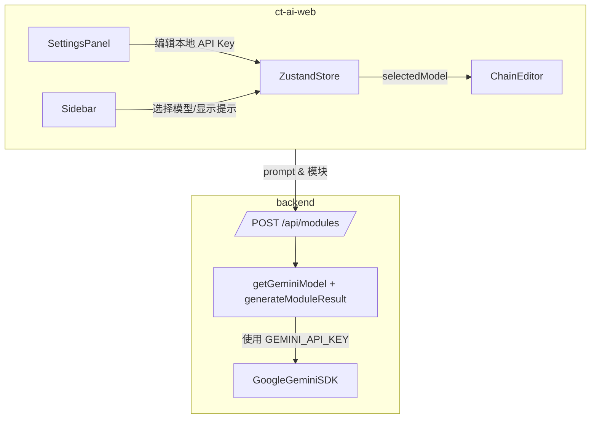

# DESIGN_AI模型调用增强

## 1. 总体方案概览
- **目标**：更新前端模型展示为当前主流、支持图像生成/编辑的国内外模型，并在 UI 中明确 VPN 提示；后端保持 Gemini 实际调用能力并指导配置环境变量。
- **思路**：
  - 前端：重构 `AI_MODELS` 常量、扩展模型属性（图像编辑能力、是否需要 VPN），在 `Sidebar` 和设置窗口中强化提示。
  - 后端：继续复用 `generateModuleResult`；补充 `.env.local` 配置文档和示例；提供检测日志。

## 2. 分层设计与核心组件
- **前端**
  - `ct-ai-web/src/types/index.ts`：更新 `AI_MODELS` 数据源，补充模型列表（Gemini、OpenAI DALL·E、Stability Stable Diffusion、Midjourney、Adobe Firefly、百度文心一格、阿里通义万相、腾讯混元、商汤日日新等）。
  - `Sidebar`：基于 `requiresVPN` 显示“需VPN”标记；确保下拉中按国内/国外分组或显示显著标签。
  - `SettingsPanel`：已有 VPN 配置 Tab，补充提示说明国外模型需启用；保留 API Key 输入。
  - 文档/提示：在 UI 或帮助文本中说明如何配置代理。

- **后端**
  - `.env.example` 已包含 `GEMINI_API_KEY` 字段；在 `.env.local` 中写入真实值。
  - `env.ts` 已强制校验密钥；要确保部署说明提醒。
  - `generateModuleResult`：继续使用 Google Gemini Flash Image 模型。

## 3. 接口契约
- `POST /api/modules`
  - **请求**：`{ prompt: string }`
  - **响应**：`{ image: string }`（Base64 data URI）
  - **错误**：400 prompt 缺失、500 Gemini 调用失败
  - **依赖**：`GEMINI_API_KEY` 有效

## 4. 数据流向
1. 用户在前端选择模型并配置 API Key。
2. 前端提交 prompt → 后端 `generateModuleResult`。
3. 后端使用 `GEMINI_API_KEY` 真实调用 Gemini，返回 Base64 图像。
4. 前端展示生成的结果图。

## 5. 异常处理策略
- `GEMINI_API_KEY` 缺失：后端立即抛错（400/500）。
- Gemini 返回无图像数据：抛出错误提示“Gemini did not return image data”。
- 网络或代理故障：捕获并转换为 500 错误信息，前端在设置面板的 VPN Tab 指导用户检查代理。

## 6. 兼容性与扩展
- `AI_MODELS` 结构保持兼容，新增模型时只需扩充数组。
- 后端可后续扩展为多模型路由（例如添加 `model` 字段），当前阶段仅 Gemini。

## 7. 验收标准
- 设置面板的 API Key Tab 可输入新模型对应的 Key（至少展示 Gemini/OpenAI/百度/阿里/腾讯/商汤等）。
- 模型列表显示主流模型，国外模型明确标记需 VPN。
- `.env.local` 中存在 `GEMINI_API_KEY` 且后端调用成功返回图像数据（可通过 curl 验证）。
- 相关文档更新，明确 Key 配置和 VPN 提示。

