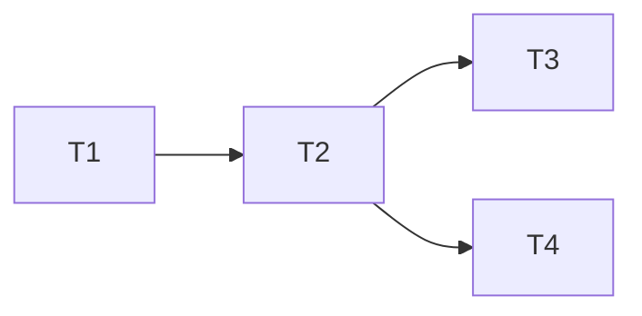

# TASK_AI模型调用增强

## 任务分解概览

- **T1. 前端模型列表更新**
  - **输入契约**：`AI_MODELS` 当前定义；行业主流模型需求。
  - **输出契约**：更新后的 `AI_MODELS` 列表仅包含支持图像生成/编辑的国内外主流模型；`requiresVPN` 等字段准确。
  - **实现约束**：保持 TypeScript 类型一致；遵循现有 UI 样式；模型名需中英文结合便于识别。
  - **依赖关系**：无。

- **T2. UI 提示与交互增强**
  - **输入契约**：更新后的 `AI_MODELS`；`SettingsPanel` 组件。
  - **输出契约**：Sidebar 模型下拉清晰标记国内/国外与 VPN 要求；SettingsPanel VPN Tab 增加国外模型说明。
  - **实现约束**：不破坏现有布局；提示文本保持中文；依旧使用 Zustand 状态。
  - **依赖关系**：依赖 T1 的模型数据。

- **T3. 后端环境配置与验证**
  - **输入契约**：用户提供的 `GEMINI_API_KEY`；`.env.example` 模板；`env.ts` 校验逻辑。
  - **输出契约**：`backend/.env.local` 写入真实 Key；文档中记录配置步骤；通过 `curl` 或测试确认 Gemini 调用成功。
  - **实现约束**：`.env.local` 不纳入版本控制；不暴露 Key 于公共文档。
  - **依赖关系**：可与 T2 并行，最终需整体验证。

- **T4. 文档更新**
  - **输入契约**：T1-T3 的成果；现有文档结构。
  - **输出契约**：在 `docs/AI模型调用增强` 或原有指南中，增加环境变量、VPN 提示、模型列表说明。
  - **实现约束**：中文；与既有文档风格一致。
  - **依赖关系**：依赖 T2/T3。

